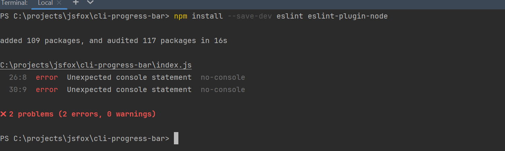
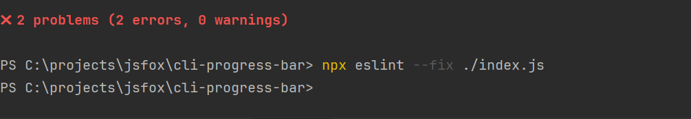
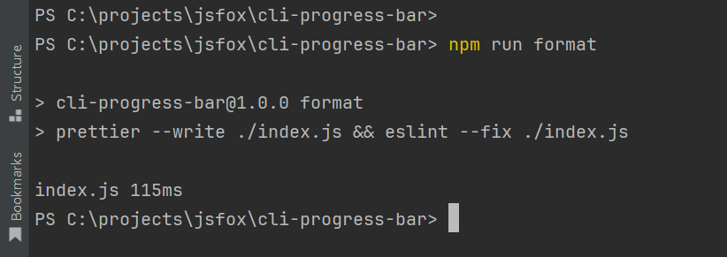
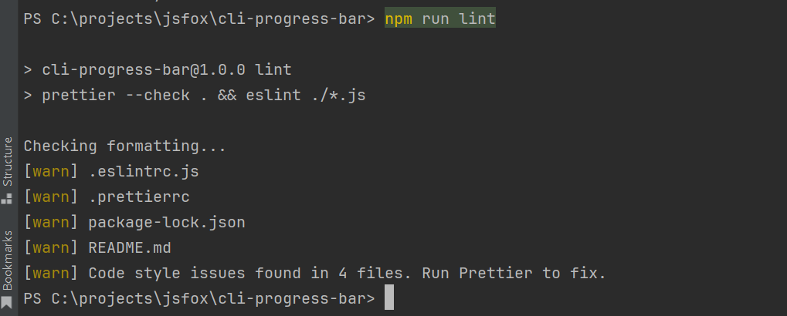

# What does it do?
It shows us progress bar in terminal, while reading file.

# How it works?
First we count the filesize, and the

# Task 2.1 linters
1. When I started eslint autofix it found 2 errors that are not fixable in auto. 
2. I deleted console.log('Done!') and added comment about excluding check on console.error('...'). 
3. Custom format script works like that. 
4. Custom lint script. 